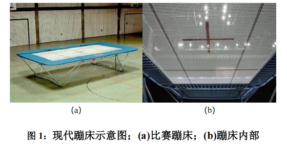

# 基于多刚体动力学模型的蹦床运动力学问题研究

## 摘要

蹦床运动是一项结合力学与技巧的竞技项目，运动员通过蹦床的弹性特性完成高难
度动作。本文通过构建动力学方程并结合生物动力学约束建立了多刚体动力学模型，旨
在分析运动员起跳与腾空阶段的力学行为，优化动作技术并制定蹦床疲劳损伤最小化策
略提供依据。

针对问题一，本文建立了多刚体动力学模型。首先将运动员看成由小腿、大腿和躯
干组成的三段刚体。然后采用平行轴定理，按每段刚体的质量分布计算各刚体的转动惯
量。其次根据牛顿第二定律，对每段刚体建立动力学方程从而建立了多刚体动力学模型。
再以运动员的最大输出功率和能量转换效率作为生物动力学约束，最后通过四阶龙格-
库塔法迭代求解多刚体动力学模型，得到前倾 30°并以指数衰减发力(1100N，20s-1
)即可完成前空翻的结论。

针对问题二，本文构建了运动员动力学方程。首先我们将运动员从起跳到落地的过
程分为三个阶段，上升阶段：仅受重力和空气阻力作用；下落阶段：受重力、空气阻力
和蹦床弹性恢复力作用；接触阶段：受弹性力、重力和空气阻力共同作用。然后再分别
针对这三个阶段，利用牛顿第二定律构建动力学方程。最后通过四阶龙格-库塔法求解，
得出的结果如图 9 所示，并对起跳高度与落地姿势的冲击力进行优化分析。

针对问题三，本文采用了两种不同的方案。方案一构建了多人动力学模型，首先针
对运动员的垂直运动情况，构建了垂直运动方程。然后通过蹦床的全局叠加条件，构建
了蹦床疲劳损伤模型。最后通过数值模拟的方式验证模型的合理性，并得出采用策略后
蹦床寿命提升 5.6 倍的结论。由于方案一的策略实际情况下难以实现，故本文提出了方
案二：多人站立位置优化模型。首先我们将蹦床离散化，并采用线性插值的方法确定蹦
床上各点的刚度系数。然后通过蹦床的全局叠加条件构建了多人站立位置优化模型。最
后通过遗传算法求解优化模型，得到的运动员基本参数及位置结果如表 5 所示。

对于模型的分析与检验部分，首先本文对上述三个问题中的模型进行了灵敏度分析。
然后得出模型对发力角度、刚度系数及材料参数高度敏感，但对体重分布与起跳时序的
调整策略具有较强鲁棒性的结论，具体结果如表6所示。最后本文还对模型进行了评价、
改进与推广，以期为蹦床运动的技术优化、设备疲劳寿命预测提供科学依据，并为体操
器械设计、材料疲劳评估等工程领域的研究提供可扩展的建模框架。

关键词：多刚体动力学模型；生物动力学约束；四阶龙格-库塔法；灵敏度分析

## 问题背景

蹦床运动是一项结合力学与技巧的竞技项目，运动员通过蹦床的弹性特性完成高难
度动作。其力学行为涉及起跳、空中姿态调整和落地冲击等多个复杂过程，与蹦床的弹
性恢复性能、空气阻力及人体动力学密切相关。研究蹦床的力学行为可为优化运动员技
术动作、设计蹦床设备及降低运动损伤提供理论依据。现代蹦床赛事，弹床内共 112 个
弹簧，框架长 5.050 米，宽 2.910 米，高 1.15 米，网长 4.028 米，宽 2.014 米。蹦
床网面为矩形网面，用一组纵向设置的纵网带和一组横向设置的横网带编制而成，共包
含 223×145 个网格。

## 问题提出

- 问题 1：针对身高 1.75 米的运动员完成“前空翻”动作的需求，分析其在起跳瞬间的
发力方向、大小及发力与身体姿态的关系，建立力学模型，并通过数值模拟验证模型的
合理性。
- 问题 2：建立运动员从起跳到落地的动力学方程，综合考虑空气阻力和蹦床弹性恢
复特性，确定落地时的速度与受力情况，在不考虑重心变化的前提下，探讨如何通过调
整起跳高度和落地姿势减少冲击力。
- 问题 3：建立多运动员参与的动力学模型，分析体重分布与起跳时序对蹦床受力及
疲劳损伤的影响，提出最小化疲劳损伤的策略，并预测对蹦床疲劳寿命的提升效果。